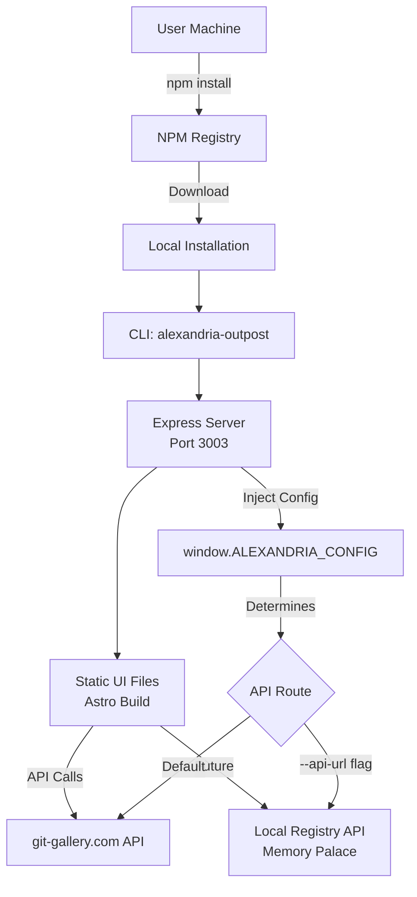

# Alexandria Outpost - NPM Package Architecture



## Overview

Alexandria Outpost is an npm package that lets users run the Alexandria UI locally while connecting to either remote or local repository registries.

## Key Components

### 1. NPM Package Configuration [0,0]
The package is defined in `package-outpost.json` with the built assets stored in:
- `dist/cli.js` - CLI entry point
- `dist/server.js` - Express server module
- `outpost-dist/` - Pre-built Astro UI files

### 2. Runtime Configuration [0,1]
API configuration is implemented across multiple components:
- `src/components/Alexandria.tsx` - Main component with runtime config check
- `src/components/RepositoryViewer.tsx` - Repository viewer with API config
- `src/components/ViewDisplay.tsx` - Document viewer with API config
- `scripts/build-server.js` - Builds the server that injects config

The API endpoint is configurable at runtime without rebuilding:
```javascript
// Checks in order:
window.ALEXANDRIA_CONFIG?.apiUrl  // Runtime injection
import.meta.env.PUBLIC_ALEXANDRIA_API_URL  // Build-time
'https://git-gallery.com'  // Default
```

### 3. Build System [1,0]
Build configuration and scripts:
- `astro.config.outpost.mjs` - Astro build configuration for npm package
- `scripts/publish-outpost.sh` - Publishing automation script
- `.npmignore` - Controls what gets published to npm

### 4. Usage [1,1]
```bash
# Install globally
npm install -g @a24z/alexandria-outpost

# Run with defaults (port 3003, remote API)
alexandria-outpost serve

# Use local API (future Memory Palace integration)
alexandria-outpost serve --api-url http://localhost:3002
```

## Distribution Strategy

1. **Build Phase**: Astro compiles UI to static files
2. **Package Phase**: Bundle UI + server + CLI 
3. **Runtime Phase**: Server injects config and serves UI
4. **API Phase**: UI connects to configured endpoint

## Memory Palace Integration

Future integration will allow Memory Palace to:
- Implement local registry API endpoints
- Scan local directories for `.a24z` folders  
- Serve repository metadata locally
- Enable fully offline operation

## Technical Decisions

- **Static Build**: UI is pre-built to avoid requiring Astro on user machines
- **Runtime Config**: API URL configurable without rebuild for flexibility
- **Express Server**: Lightweight server to inject config and serve files
- **Dual Mode**: Supports both remote (current) and local (future) registries