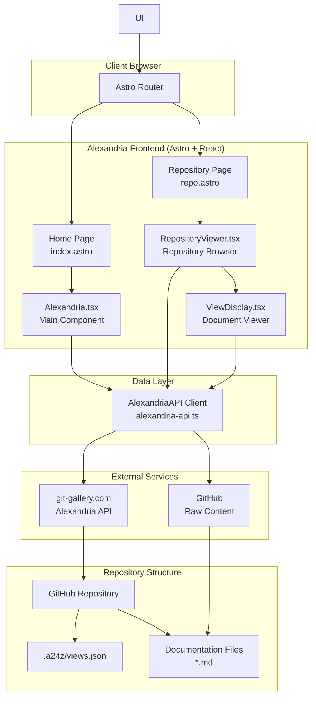
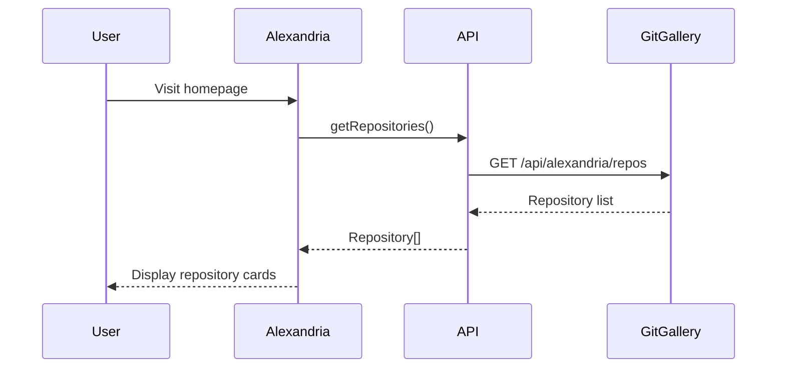
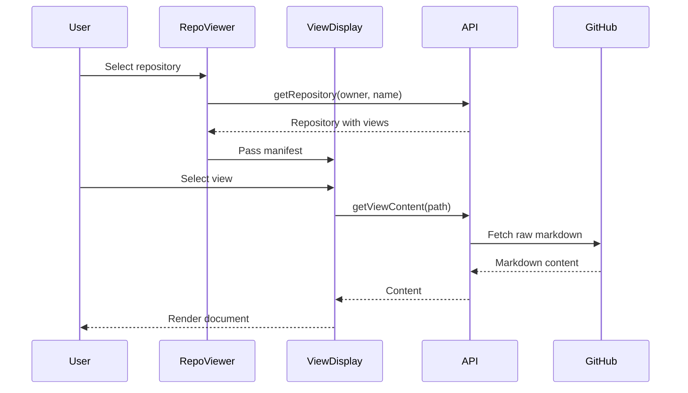

# Alexandria Architecture Overview

Alexandria is a centralized platform for discovering and browsing a24z-memory documentation across GitHub repositories. It provides a beautiful, searchable interface for exploring technical documentation, architectural decisions, and development patterns.

## System Architecture



## Core Components

### 1. Frontend Layer (Astro + React)

The frontend is built with Astro for static site generation and React for interactive components.

#### **Pages (Astro)**
- `index.astro`: Entry point that renders the Alexandria component
- `repo.astro`: Repository viewer page with dynamic routing

#### **Main Components (React)**

##### **Alexandria.tsx**
The main application component that:
- Fetches and displays all registered repositories
- Provides search functionality (when >15 repos)
- Handles navigation to individual repositories
- Integrates with the Alexandria API

##### **RepositoryViewer.tsx**
Repository browser that:
- Parses owner/name from URL query params
- Fetches repository data from the API
- Transforms data for ViewDisplay component
- Handles loading and error states

##### **ViewDisplay.tsx**
Document viewer that:
- Displays repository views in a sidebar
- Groups views by category (tutorials, guides, etc.)
- Fetches and renders markdown content from GitHub
- Provides collapsible sidebar with persistent state
- Custom markdown rendering with syntax highlighting
- Quick access GitHub button to view source repository

### 2. Data Layer

#### **AlexandriaAPI Client**
A TypeScript client (`alexandria-api.ts`) that handles all API communications:

**Repository Operations:**
- `getRepositories()`: Fetch all registered repositories
- `getRepository(owner, name)`: Get specific repository details
- `registerRepository()`: Register new repository
- `refreshRepository()`: Update repository data

**Content Operations:**
- `getViewContent()`: Fetch markdown from GitHub
- `searchRepositories()`: Search with filters (future)

**API Endpoints:**
- Base URL: `https://git-gallery.com`
- Repository list: `GET /api/alexandria/repos`
- Repository details: `GET /api/alexandria/repos/{owner}/{name}`
- Register: `POST /api/alexandria/repos`
- Refresh: `POST /api/alexandria/repos/{owner}/{name}/refresh`

### 3. Repository Integration

Repositories integrate with Alexandria through a `.a24z/views.json` manifest:

```json
{
  "version": "1.0.0",
  "repository": "owner/repo-name",
  "views": [
    {
      "id": "getting-started",
      "name": "Getting Started",
      "description": "Learn the basics",
      "category": "tutorial",
      "overviewPath": "docs/getting-started.md",
      "tags": ["beginner", "tutorial"]
    }
  ]
}
```

### 4. Data Flow

#### **Repository Discovery Flow**



#### **Document Viewing Flow**



## Key Features

### UI/UX Features
- **Dark Mode**: Toggle between light/dark themes
- **Collapsible Sidebar**: Persistent state in localStorage
- **Search**: Command palette (Cmd+K) when >15 repos
- **Responsive Design**: Mobile-friendly layout
- **Syntax Highlighting**: Code blocks with highlight.js

### Content Features
- **Markdown Rendering**: Full GFM support with React Markdown
- **View Categories**: Organize by tutorials, guides, references
- **Repository Metadata**: Stars, languages, last updated
- **Direct GitHub Links**: Link to source repositories

### Technical Features
- **Static Site Generation**: Fast loading with Astro
- **GitHub Pages Deployment**: Automated CI/CD
- **TypeScript**: Full type safety
- **Tailwind CSS**: Utility-first styling
- **shadcn/ui Components**: Consistent, accessible UI

## Deployment

Alexandria is deployed as a static site on GitHub Pages:

1. **Build Process**: Astro builds static HTML/CSS/JS
2. **GitHub Actions**: Automated deployment on push to main
3. **Base Path**: Deployed at `/alexandria/` subdirectory
4. **Assets**: Optimized and bundled by Astro

## Environment Configuration

- `PUBLIC_ALEXANDRIA_API_URL`: API endpoint (defaults to git-gallery.com)
- Base path configuration for GitHub Pages deployment

## Technology Stack

- **Framework**: Astro 5.x - Static site generator
- **UI Library**: React 19.x - Interactive components
- **Components**: shadcn/ui - Radix UI + Tailwind
- **Styling**: Tailwind CSS 4.x
- **Markdown**: react-markdown with GFM, syntax highlighting
- **Package Manager**: Bun (with npm fallback)
- **Deployment**: GitHub Pages via Actions

## Future Enhancements

### Phase 2: API Integration
- Live API connection
- Repository registration workflow
- Advanced search functionality

### Phase 3: Enhanced Features
- GitHub authentication
- Real-time updates via webhooks
- Full-text search
- Analytics dashboard

### Phase 4: Community
- User submissions via PRs
- Comments and discussions
- Version history
- Multi-language support