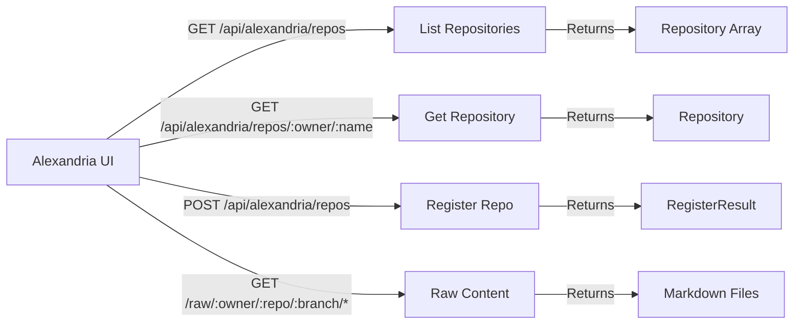

# Alexandria Outpost - Local Server API Specification



## Required API Endpoints

The Memory Palace local server needs to implement these endpoints to support Alexandria Outpost:

### 1. List Repositories
```typescript
GET /api/alexandria/repos

Response: AlexandriaRepositoryRegistry {
  repositories: AlexandriaRepository[],
  total: number,
  lastUpdated: string
}
```

### 2. Get Repository
```typescript
GET /api/alexandria/repos/:owner/:name

Response: AlexandriaRepository
```

### 3. Register Repository (Optional)
```typescript
POST /api/alexandria/repos

Body: {
  owner: string,
  name: string,
  branch?: string
}

Response: {
  success: boolean,
  repository: {
    id: string,
    owner: string,
    name: string,
    status: 'registered' | 'updated',
    message: string,
    hasViews: boolean,
    viewCount: number,
    views: CodebaseViewSummary[]
  }
}
```

### 4. Raw Content Access
```typescript
GET /raw/:owner/:repo/:branch/:path

Response: Raw markdown content (text/plain)
```

## Type Definitions

The Alexandria Outpost uses standardized types from the `a24z-memory` package for consistency across the ecosystem.

### Importing Types
```typescript
import type { 
  AlexandriaRepository,
  AlexandriaRepositoryRegistry 
} from 'a24z-memory/dist/pure-core/types/repository';
import type { CodebaseViewSummary } from 'a24z-memory/dist/pure-core/types/summary';
```

### Repository (AlexandriaRepository)
```typescript
interface AlexandriaRepository {
  id: string;                      // Used for React keys
  owner: string;                   // Displayed and used for navigation
  name: string;                    // Displayed and used for navigation
  description: string;             // Shown in repository cards
  stars: number;                   // Displayed with special formatting (k for thousands)
  hasViews: boolean;              // Controls chapter count badge visibility
  viewCount: number;              // Shows number of chapters
  views: CodebaseViewSummary[];   // The actual codebase views to display
  tags?: string[];                // Shown as badges (first 4 displayed)
  metadata?: {
    license?: string | null;      // Shown with license icon
  };
}
```

### CodebaseViewSummary
```typescript
interface CodebaseViewSummary {
  id: string;
  name: string;
  description?: string;
  category?: string;
  overviewPath?: string;
  timestamp?: string;
  metadata?: {
    rows?: number;
    cols?: number;
    cellCount?: number;
  };
}
```

## Local Implementation Guide

### Package Installation
To use the standardized types in your Memory Palace implementation:
```bash
npm install a24z-memory
```

### File System Structure
The Memory Palace server should scan for repositories with `.alexandria` folders:
```
~/repos/
  project-a/
    .alexandria/
      views.json
      views/
        *.json
  project-b/
    .alexandria/
      views.json
```

### Repository Discovery
1. Scan configured directories for `.alexandria` folders
2. Read `views.json` to get available views
3. Map to Repository type structure
4. Cache results for performance

### Content Serving
For the `/raw` endpoint, serve files directly from the local filesystem:
```javascript
app.get('/raw/:owner/:repo/:branch/*', (req, res) => {
  const filePath = resolveLocalPath(req.params);
  res.sendFile(filePath);
});
```

## Configuration

The Memory Palace server should accept configuration for:
```json
{
  "registryPaths": [
    "~/repos",
    "~/projects"
  ],
  "port": 3002,
  "scanInterval": 300,  // seconds
  "enableCache": true
}
```

## Error Responses

Use consistent error format:
```typescript
interface APIError {
  error: {
    code: string;
    message: string;
  };
}
```

Common error codes:
- `REPO_NOT_FOUND` - Repository doesn't exist
- `VIEW_NOT_FOUND` - View doesn't exist
- `FILE_NOT_FOUND` - Requested file not found
- `INVALID_REQUEST` - Malformed request

## CORS Configuration

Enable CORS for local development:
```javascript
app.use(cors({
  origin: ['http://localhost:3003', 'http://localhost:3000'],
  methods: ['GET', 'POST'],
  credentials: true
}));
```